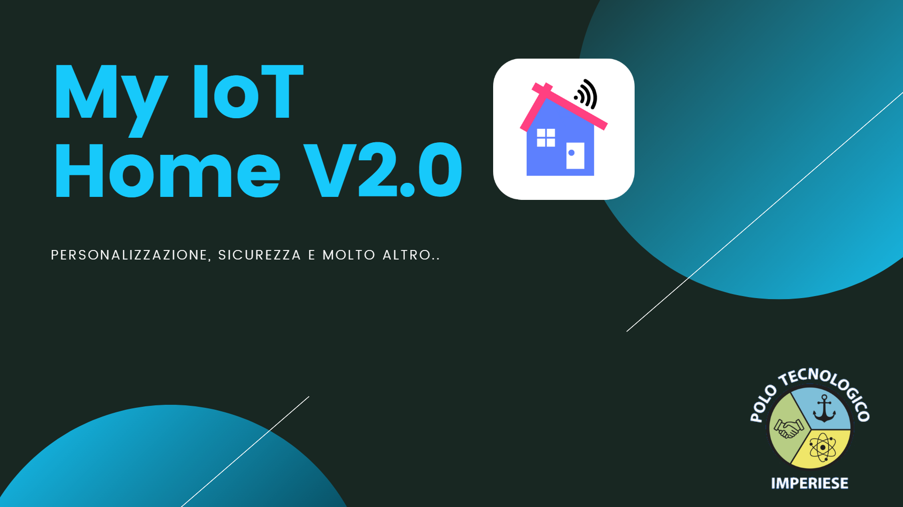

# My IoT Home V2.0

## Abstract - 🇬🇧

My IoT Home V2.0 is a highly customizable computer system, which through a Mobile App enables the user to have real-time control of his home. The system involves the use of multiple sensors and actuators connected to WeMos D1 R2 WiFi microcontrollers equipped with the ESP8266 module. These ones, using the MQTT protocol, communicate the detected data to a single board computer: a Raspberry 3B+. The data reached the Raspberry are processed by a Python program that interacts with a Real-Time Database and a Storage, hosted in-cloud by the Firebase platform. The data detected and any photos and files are displayed through the dashboard of a Mobile App programmed in Flutter. The same app is able to report alarms thanks to the integration of Push Notification and the FCM technology. Every detail of this product has been developed to ensure the reliability of the system and a pleasant user experience.

**Keyword** : Arduino, ESP8266, Mqtt, Raspberry, Firebase, Real Time Database

## Abstract - 🇮🇹

My IoT Home V2.0 è un sistema informatico altamente customizzabile, che tramite Mobile App abilita l’utente ad avere il controllo in tempo reale della sua abitazione. Il sistema prevede l’impego di più sensori e attuatori connessi a dei microcontrollori WeMos D1 R2 WiFi dotati del modulo ESP8266. Questi ultimi, mediante protocollo MQTT, comunicano i dati rilevati ad un single board computer: un Raspberry 3B+. I dati giunti al Raspberry vengono elaborati da un programma in Python che interagisce con un Real Time Database ed uno Storage, ospitati sulla piattaforma incloud Firebase. I dati rilevati ed eventuali foto e file, vengono visualizzati attraverso la dashboard di una Mobile App programmata in Flutter. La medesima app è in grado di segnalare allarmi grazie all’integrazione delle Push Notification e alla tecnologia FCM. Ogni dettaglio di questo prodotto è stato sviluppato al fine garantire l’affidabilità del sistema e di assicurare un’esperienza utente gradevole.

**Parole chiave** : Arduino, ESP8266, Mqtt, Raspberry, Firebase, Real Time Database

## Elaborato e fasi di progettazione

## Slides di presentazione del progetto

